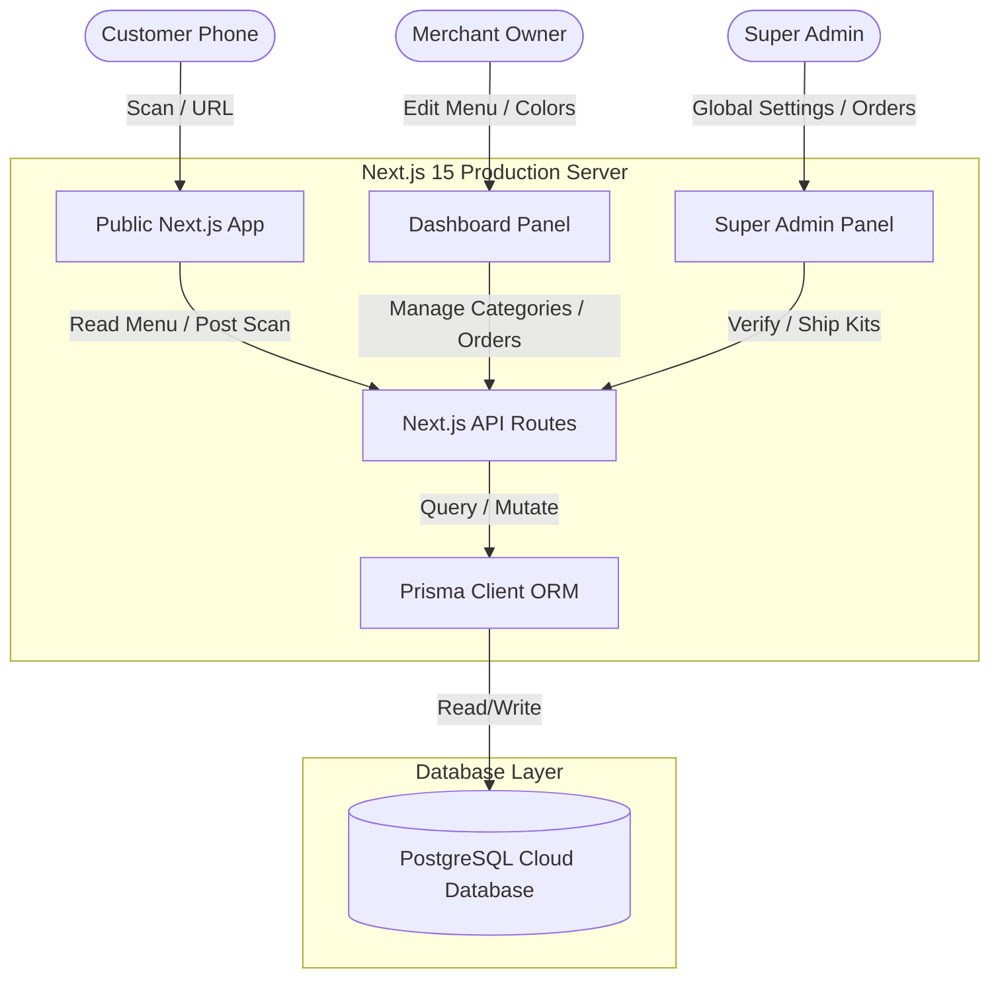

# Product Requirement Document (PRD)

## Product Name: Dineo
**Version:** 1.0 (Phase 1 Completed)  
**Author:** AI Coding Assistant Team (Antigravity)  
**Date:** July 2026  

---

## 1. Product Vision & Overview
**Dineo** is a premium, modern, commercial-grade Software-as-a-Service (SaaS) platform designed for restaurants. It replaces outdated paper menus with dynamic, customizable digital QR menus. 

### Core Value Proposition
- **Instant Menu Updates:** Restaurants update prices, availability, and descriptions in real-time without re-printing physical assets.
- **Zero App Download:** Customers scan a permanent QR code on their phone camera to instantly view a responsive, visually stunning digital menu.
- **Advanced Analytics:** Restaurant owners receive live visitor metrics, scan locations, device/browser breakdowns, and category/item popularity charts.
- **Premium Customization:** Gated plan tiers (Free, Pro, Enterprise) unlock dynamic banner upgrades, custom brand colors, custom logos, and vector SVG menu downloads.
- **Physical QR Standee Ordering:** Integrated pipeline to order physical acrylic stands, window clings, and table numbers directly from the dashboard with visual delivery tracking.

---

## 2. System Roles & User Personas

### A. Customer (Menu Visitor)
A guest dining at a restaurant or passing by.
* **Needs:** Fast menu loading, clear dietary markings (Veg/Non-Veg standard indicators), responsive search bar, active categories, visible price details, and a premium look.

### B. Restaurant Owner (Merchant)
The primary operator managing a restaurant profile.
* **Needs:** Simple menu/category builder, brand theme editor, dynamic QR code custom downloads, live trend analytics, and physical stand ordering.

### C. Super Admin (System Operator)
The platform administrator.
* **Needs:** Overview of registered merchants, global banner announcements control, processing of physical stand orders, and management of contact inquiries.

---

## 3. Core Functional Modules

### Module 1: Authentication & Onboarding
- **User Authentication:** Password login, email verification, and password reset flows.
- **Onboarding Wizard:** Guide restaurant owners to set up their restaurant name, slug, brand colors, and first category.
- **Plan Gate Restrictions:**
  - **Free Tier:** Basic QR menu, default orange banner fallback, standard PNG code download.
  - **Pro/Enterprise Tiers:** Dynamic color customization, custom logo/cover banners, SVG Vector downloads, and custom discount coupons management.

### Module 2: Restaurant Customization & Branding (Point 1 & 2-improve)
- **Branding Panel:** Customizable restaurant details:
  - Primary Brand Color
  - Cover Banner / Cover Image
  - Logo Upload
  - Welcome Message & Description
  - Restaurant Timings (Opening / Closing checks)
  - Contact Number & Address
  - Google Maps Navigation Link & Social Media Links
- **Theme Color Injection:** Chosen colors inject dynamically throughout the public menu headers, category tabs, and action buttons.

### Module 3: Dynamic Public QR Menu (Point 2)
- **Zero-Fade Dual Gradient Header:** Premium solid gradient headers matching chosen brand themes directly (defaulting to vibrant orange: `from-orange-500 to-orange-700`).
- **Standard Dietary Badges**: Veg/Non-Veg items utilize standard square outlines with a central circle indicator.
- **Special Status Badges**:
  - `🔥 Popular` (mapped to `isBestSeller` flag).
  - `✨ Chef Special`.
  - `✨ New` (automatically calculated if items are created within the last 7 days).
- **Smooth Category Navigation**: Dynamic tabs auto-scroll viewports smoothly to `#menu-start` anchor when selected.
- **Optimized Perceived Load Time**: Clean SVG structure skeleton loaders replace standard page spinners on initial route load.

### Module 4: Live Visitor Analytics (Point 4)
- **Live Scans Tracker**: Logs scan timestamp, device OS (iOS, Android, Windows, macOS, Linux), browser (Safari, Chrome, Firefox, Edge, Opera), and country/city origin (via Vercel IP location headers).
- **Daily Scan Trend Graph**: Responsive interactive SVG line chart aggregating scan logs daily for the last 7 days, complete with hover tooltips and gradient fills under the trend line.
- **Popularity Tracking**: Clean dynamic event-based category/item views logging to record real views when visitors navigate tabs.

### Module 5: QR Starter Kit Pre-Orders (Point 5)
- **Visual Starter Kit Shop**: Showcase Premium Acrylic Stands, Waterproof Table Stickers, Window Clings, and Table Numbers with exact materials, pricing, and sizing details.
- **Dynamic Cost Summary**: Auto-calculates prices based on quantity, free shipping overrides for orders above ₹1000, and a progress helper text to unlock free shipping.
- **Order Tracking Stepper**: Visual tracking milestone stepper (Requested ➜ Processing ➜ Shipped ➜ Delivered) to track pre-order fulfillment status.

### Module 6: QR Poster Generator (Point 6)
- **Sizing Format Selector**: Choose from standard **A4 Poster**, **A5 Stand**, or **Square Block** layouts.
- **High-Res PDF Downloads**: High-quality client-side PDF generation incorporating `jsPDF` capturing the exact styled QR poster card.
- **Vector SVG Downloads**: Pro tier users can download transparent SVG vector assets of the QR code for print.

### Module 7: Global Admin Settings
- **Merchant Directories**: View, filter, suspend, or reactivate restaurant domains.
- **Global Promotional Banners**: Manage system-wide notification banners across guest landing and owner dashboard templates.

---

## 4. Technical Architecture

### Database Schema Models
1. **`User` / `Account` / `Session` / `Verification`**: Auth credentials and OAuth tracking.
2. **`Restaurant`**: Central business profile containing brand settings, theme selections, opening timings, and active subscription details.
3. **`Category` / `MenuItem`**: Hierarchical menu layout holding item prices, availability state, and dietary designations.
4. **`QRCode` / `QRScan`**: QR permanent codes and individual scan metric tracking rows.
5. **`QRKitRequest`**: Log of pre-orders, quantities, selected stands, QR colors, and shipping status.
6. **`GlobalSettings`**: System-wide notifications and announcement texts.

---

## 5. Non-Functional & Security Requirements

### A. Performance & Speed
- Layout skeletons for high perceived load speeds.
- Serverless static path generation for dynamic sitemaps.
- Lazy dynamic imports for heavy utilities like `jspdf` and `html-to-image` to keep bundling overhead minimal.

### B. SEO Optimization
- Dynamic meta elements generation (Titles, Descriptions, OpenGraph headers, Twitter summaries) generated dynamically per restaurant.
- Automatically generated dynamic `sitemap.xml` listing active menu slugs.
- Dedicated `robots.txt` allowing indexing of public menus (`/menu/*`) while strictly blocking search engine crawlers from dashboard pages (`/dashboard/`, `/settings/`, `/api/*`).

### C. Analytical Integrity
- Session-gated scan counting to prevent visitor spam from inflating metrics.
- Event-driven category views tracking to ensure counts are accurately based on customer focus actions.
